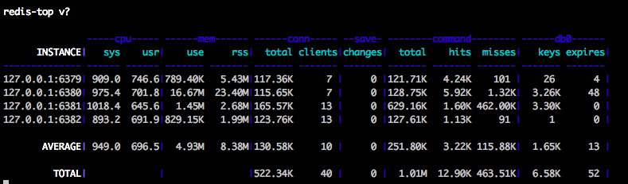

# App::RedisTop
redis-top - Redis resource statistics tool.

## Installation

    cpanm App::RedisTop

or

    curl -L -o redis-top https://raw.github.com/toritori0318/p5-App-RedisTop/master/redis-top-pack
    perl redis-top

## ScreenShot

## Usage

    Usage:
        redis-top [options]

      Example:
        redis-top -i 127.0.0.1:6379,127.0.0.1:6380,127.0.0.1:6381,127.0.0.1:6382
        redis-top --sleep 1 --nocolor --cpu --memory --db
        redis-top -cMnsCd  # full

    Options:
      Group Options:
        -c,--cpu
            enable cpu stats

        -M,--memory
            enable memory stats

        -n,--conn
            enable connection stats

        -s,--save
            enable save stats

        -C,--command
            enable command stats

        -d,--db
            enable db stats (default:db0 stats)

      Global Options:
        --sleep
            sleep time (default:3)

        --nocolor
            disable colors

        -h --help
            show help

## License

This library is free software; you can redistribute it and/or modify

it under the same terms as Perl itself.

